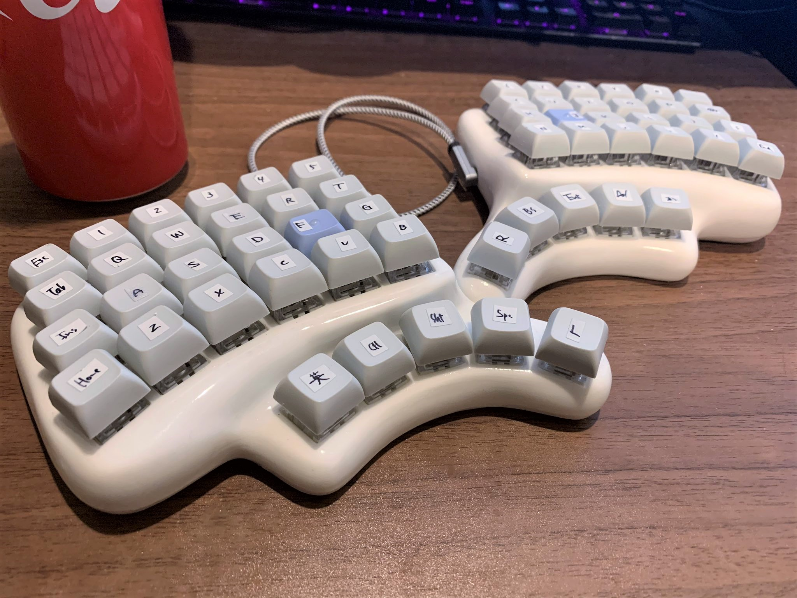

# msw58

3Dプリンターで作る手配線 左右分離型キーボードです。  
[helix]( https://github.com/qmk/qmk_firmware/tree/master/keyboards/helix )互換?な感じにしています。

* 回路の変更はキーの数を変えたのみです。  
手配線の回路が悪いかをhelixのファームウェアを書き込んで確かめられます。

* ファームウェアもキーの数を変えてキーマップを好きに変えただけです。




3Dプリンタ－で印刷できるように、STLファイルを[./model](./model)に置いています。  
GithubはSTLファイルそのまま表示できてすごいですね...  
印刷するときの注意点として、インフィルは100%をお勧めします。  
樹脂だとインフィルをすかすかにすると軽くて打鍵時に動きやすいです。  
また後加工する場合外壁が薄いと容易に穴が開きます\_(:3 」∠ )\_  

モデルはfusion360で作成しています。  
fusion360の使い方がいまいちわかっておらず、
github的なところで完全な状態で共有ができる方法がわからないので、  
STLファイル以外は置いていません。  
需要があるかわかりませんが、元データが欲しい場合、[@xcd0](https://twitter.com/xcd0)にご相談ください。  

## ファームウェアのビルド方法

1. 任意のディレクトリに[QMK firmware](https://github.com/qmk/qmk_firmware)をクローンします。  
もちろん既存のものでも構いません。  

以下、例として`~/work`にQMKをクローンする場合を書きます。
```
cd ~/work
git clone https://github.com/qmk/qmk_firmware
```

2. `qmk_firmware`と同じ階層にこのリポジトリをクローンします。

```
git clone https://github.com/xcd0/msw58
```

3. `build.sh`を実行します。  
やっていることはただこぴってコマンド実行してhexをとってくるだけです。
```
cd ~/work/msw58
./build.sh
```

4. `build.sh`と同じディレクトリに`msw58_rev2_default.hex`ができます。
あとはこれを書き込むだけです。私は[QMK Toolbox](https://qmk.fm/toolbox/)を使って書き込んでいます。


